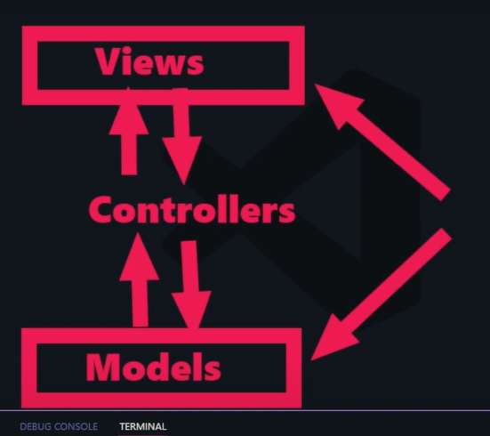

# AULAS:

### MINHA PLAYLIST:
### [Customtkinter c/ Arquitetura MVC](https://www.youtube.com/playlist?list=PLemyHd_j0duAYSurKP2-SDf1v3eQCLiAZ)
---

### [01/SGF - Preparação do Ambiente e Executando a nossa primeira Janela.](https://www.youtube.com/watch?v=cj0qDJcH1s0)

- Criação de arq **_README.md_**;
- Criação de arquivo **_main.py_**;
- Criação pastas (MCV) e seus arquivos de `__init__`;
- Criação da classe `AppController` e sua função `run()`;
- Instanciação de `AppController` em **_main.py_** e função `run()`;

### [02/SGF - Modelo de Usuários - Banco de Dados](https://www.youtube.com/watch?v=GSk3vLjjM8w)

- Criação de arquivo **_database.py_**, 
    - import de _sqlite3_,
    - criação classe `DataBase` e sua função `create_tables()`,
        - ativação da função criada no `__init__` da classe;
- Import de `DataBase` para o arquivo **_app_controller_**,
    - instanciação da classe `DataBase` no `__init__` da classe `AppController` (criando a tabela caso ela ainda não exista quando o programa for rodado);
- Rodar o programa em **_main.py_** para ver a criação da tabela;

### [03/SGF || CUSTOMTKINTER - Banco de Dados com Python - Criando tabela de funcionários](https://youtu.be/XmEgkA5m_RE?si=B0AO_lXk3jz978mr)

- Adicionou a criação da tabela _employees_ dentro da função `create_tables`;
- Rodou o programa em **_main.py_** para confirmar criação da tabela dentro do arquivo **_app.db_**;

### [04/SGF || CUSTOMTKINTER - Navegação entre Telas (LOGIN - DASHBOARD)](https://youtu.be/j2wb4GYdSCc?si=bvrVEptCNDleUPXc)
- Em **_app_controller_** definiu o que precisaria ser criado com comentários:

    ``` python
            # Tela de login
            
            # Criação de admin padrão (se não houver ainda um admin criado)

        # Controle de login do usuário
        def login(self):
            ...
        
        def logout(self):
            ...


        # Mostrar a tela de dashboard
        def show_dashboard_view(self):
            ...
    ```

- Criou arquivos **_dashboard_view.py_** e **_login_view.py_**:
    - definiu suas classes `DashboardView(ctk.CTkFrame)` e `LoginView(ctk.CTkFrame)`,
        - subordinou elas ao atributo `AppController.root`(a CTk) e à classe `AppController`;

- Chamou no arquivo **_app_controller.py_** a classe `LoginView(ctk.CTkFrame)`;


### [05/SGF || CUSTOMTKINTER - LOGIN MODERNO🔥](https://youtu.be/S0ROkWXRYNY?si=yBiJIAldi7fCt-TA)
#### Design da tela de login:
- Arquivo **_login_view.py_**
- Trabalhou com imagens:
    - baixou de [storyset](https://storyset.com/),
    - criou uma pasta **_assets_** e dentro dela **_imgs_**, onde salvou a imagem,
    - baixou a biblioteca pillow,
    - iportou `from PIL import Image`,
    - referenciou ela dentro da classe `LoginView`:
        ```python
        # Pegar imagens
        login_image = ctk.CTkImage(light_image=Image.open("./assets/imgs/img-login.png"), dark_image=Image.open("./assets/imgs/img-login.png"), size=(350, 350))
        ```
- Criou frames para organizar tela;

- Adicionou widgets:
    - label para imagem
    - outras labels
    - entries
    - buttons

- Usou pack e grid para organizar frames e widgets na tela.


### [06SGF | EXPLORANDO O MVC COM CUSTOMTKINTER](https://youtu.be/XZ4dzcM1gcI?si=qlOhlvCbmVJvYLlJ)
- Colocou o botão de login de **_login_view.py_** para funcionar interligando com **_app_controller.py_**
    - Explicou que vai deixar a autenticação de usuário e senha para depois, para facilitar os testes
- Na classe `AppController` designou que a ação do botão de login destroi a frame da tela de login e mostra a dashboard:
    - Em **_login_view.py_** :
        ``` python
        class LoginView(ctk.CTkFrame):
            def __init__(self, parent, controller):
                super().__init__(parent)
                self.controller = controller
            # [...]
        
            # Função do botão de login
            def attempt_login(self):
                print("botão clicado")
                username = self.username_entry.get()
                password = self.password_entry.get()
                self.controller.login(username, password)
        ```

    - Em **_app_controller.py_** :
        ``` python
        class AppController:
            def __init__(self):
            # [...]
        
            # Controle de login do usuário
            def login(self, username, password):
                username = None
                password = None
                self.show_dashboard()
            # [...]

            # Mostrar a tela de dashboard
            def show_dashboard(self):
                self.login_view.destroy()
                self.dashboard_view = DashboardView(self.root, self)
                self.dashboard_view.pack(fill="both", expand=True)
        ```

### [07SGF || SideBar Menu com Customtkinter: Criando a Home Page do nosso sistema.](https://youtu.be/Ew6bN4BYXTA?si=1EdR2QsAykYqD5Zy)
#### Criar o menu da página inicial

- Cria o arquivo **_home_view.py_** (configurações básicas das outras views)

- Em **_app_controller.py_** muda o código para em vez de importar **_dashboard_view_** importar **_home_view.py_** e altera a função `show_dashboard(self)` para `show_home(self)`:

- Com comentários, define o que será feito na `classe HomeView(ctk.CTkFrame)`

    ``` python
    class HomeView(ctk.CTkFrame):
        def __init__(self, parent, controller):
            super().__init__(parent)
            self.controller = controller
            
            # Menu lateral (widgets)
            #Botões para o menu lateral
            # Mostrar o menu de usuários, somente se o user ativo for o admin
            # Frames do conteúdo da homepage
        # Função para limpar conteúdos
        # A função para mostrar a homepage
        # Função para mostrar a Dashboard
        # Função para mostrar tela de Funcionários
        # Função para mostrar Usuários


    ```

- Monta o menu lateral:

    ``` python
    class HomeView(ctk.CTkFrame):
        def __init__(self, parent, controller):
            super().__init__(parent)
            self.controller = controller

            # Menu lateral (widgets)
            self.side_menu = ctk.CTkFrame(self, width=200)
            self.side_menu.pack(side='left', fill='y', padx=10, pady=10)

            #Botões para o menu lateral
            self.btn_home = ctk.CTkButton(self.side_menu, text="Home", command=self.show_home)
            self.btn_home.pack(pady=10, padx=10)

            self.btn_dashboard = ctk.CTkButton(self.side_menu, text="Dashboard", command=self.show_dashboard)
            self.btn_dashboard.pack(pady=10, padx=10)

            self.btn_employees = ctk.CTkButton(self.side_menu, text="Funcionários", command=self.show_employees)
            self.btn_employees.pack(pady=10, padx=10)

            self.btn_users = ctk.CTkButton(self.side_menu, text="Usuários", command=self.show_users)
            self.btn_users.pack(pady=10, padx=10)


            # Mostrar o menu de usuários, somente se o user ativo for o admin
    ```
    
- Determina que o frame home será iniciado junto com o sistema

    ``` python
    class HomeView(ctk.CTkFrame):
        def __init__(self, parent, controller):
            super().__init__(parent)
            self.controller = controller
            # [...]
            # Frames do conteúdo da homepage
            self.content_frame = ctk.CTkFrame(self)
            self.content_frame.pack(side='left', fill='both', expand=True, pady=10, padx=10)

            self.show_home()
    ```

- Cada vez que mudar de frame, precisarar limpar todo o conteúdo da página anteriror com a função `clear_content(self)`

    ``` python
    class HomeView(ctk.CTkFrame):
        def __init__(self, parent, controller):
            super().__init__(parent)
            self.controller = controller
            # [...]

        # Função para limpar conteúdos
        def clear_content(self):
            for widget in self.content_frame.winfo_children():
                widget.destroy()

    ``` 
 - Cria funções para cada botão do menu lateral

    ``` python
    class HomeView(ctk.CTkFrame):
        def __init__(self, parent, controller):
            super().__init__(parent)
            self.controller = controller
            # [...]

        # A função para mostrar a homepage
        def show_home(self):
            self.clear_content()
            welcome_label = ctk.CTkLabel(self.content_frame, text="Bem-vindo ao Sistema!", font=('Arial bold', 20))
            welcome_label.pack(pady=20)

        # Função para mostrar a Dashboard
        def show_dashboard(self):
            self.clear_content()
            self.dashboard_view = DashboardView(self.content_frame, self.controller)
            self.dashboard_view.pack(fill='both', expand=True)

        # Função para mostrar tela de Funcionários
        def show_employees(self):
            self.clear_content()
            self.employees_view = EmployeeView(self.content_frame, self.controller)
            self.employees_view.pack(fill='both', expand=True)

        # Função para mostrar Usuários
        def show_users(self):
            self.clear_content()
            self.user_view = UserView(self.content_frame, self.controller)
            self.user_view.pack(fill='both', expand=True)
    ```

- Em **_home_view.py_** fazer os imports das outras views
    ``` python
    from app.views.dashboard_view import DashboardView
    from app.views.employee_view import EmployeeView
    from app.views.user_view import UserView
    ```


### [08SGF || Trabalhando com o Menu de Funcionários - Parte 1](https://youtu.be/Uh6Uu2jFZbQ?si=Y70lwx1oGEG-0OGn)

- Em **_employee_view.py_** ele adicionou comentários com tudo que vamos implementar na frame "Funcionários":

    ``` python
        # Frame de formulário (para cadastro de funcionários)

        # Widgets importantes

        # Frame de listagem de funcionários (ScrollableFrame)

        # Função para adicionar um funcionário

        # Função de atualizar a lista de funcionários após o cadastro ou ao iniciar o sistema

        # Função para exibir detalhes de funcionário

        # Função para atualizar os dados do funcionário

        # Função para deletar funcionário
    ```

- Nesta aula, criamos duas frames dentro da frame "Funcionários":

    ``` python
        class EmployeeView(ctk.CTkFrame):
            def __init__(self, parent, controller):
                super().__init__(parent)
                self.controller = controller

                # Frame de formulário (para cadastro de funcionários)
                header_frame = ctk.CTkFrame(self, fg_color="transparent") #fg_color="transparent"
                header_frame.pack(fill="x", pady=5)
                
                # Frame de listagem de funcionários (ScrollableFrame)
                self.list_frame = ctk.CTkScrollableFrame(self, fg_color="transparent", label_text="Funcionários cadastrados no Sistema", label_anchor="w", label_font=("Arial bold", 20)) #fg_color="transparent"
                self.list_frame.pack(fill="both", expand=True, pady=10)
    ```
    - Outras partes que ele comentou vão ser implementadas nas próximas videoaulas.

### [09SGF || Grid Layout na Prática - Trabalhando com o Menu de Funcionários - Parte 2](https://youtu.be/0PlVjOV6TjU?si=VqQAkMLA0KB2JSsE)
- Curiosidade: Ferramenta que ele usa para marcar a tela na video aula (achei interessante)
    - [Screen Marker & Recorder](https://apps.microsoft.com/detail/9N0FW68W0DFW?hl=neutral&gl=BR&ocid=pdpshare)


**__**
### [10SGF || Trabalhando na Funcionalidade de Salvar novo funcionário no Banco | Models](https://youtu.be/V2_Wf8kz2KM?si=dTjVGmYyoKgmRA2x)

- Explicando a arquitetura MCV
    - 
    
- Vamos trabalhar os Models nessa aula


### []()

### []()

### []()

### []()

### []()